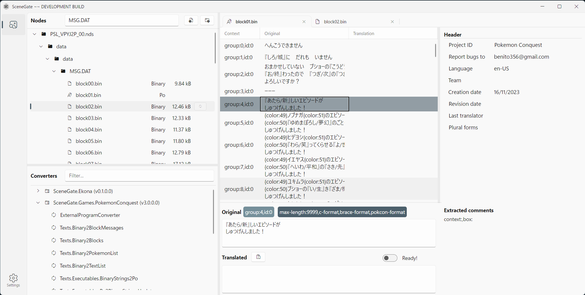
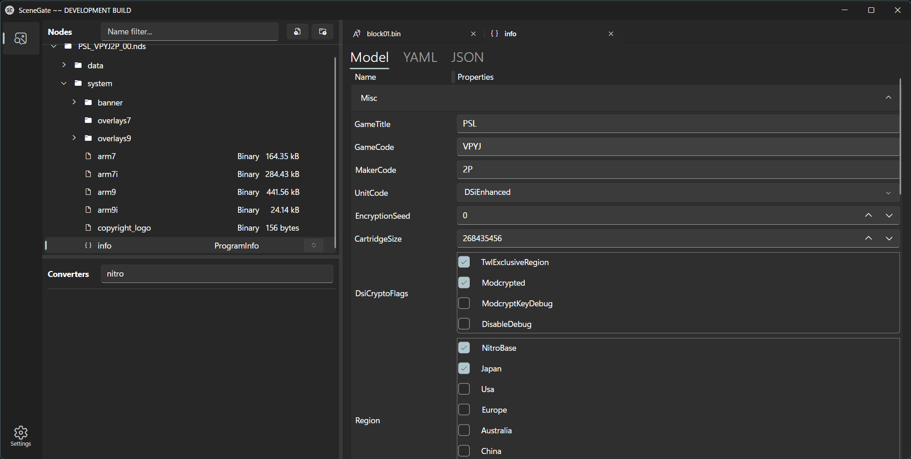

# SceneGate ](https://img.shields.io/github/v/release/SceneGate/scenegate?sort=semver)

**Work-in-progress** tool for reverse engineering, file format analysis, modding
and localization.

- 📁 Navigate the virtual file system from Yarhl.
- 🔁 Convert files with Yarhl converters via plugins.
- 🔎 View the content of files
  - .NET objects as property grid or YAML/JSON
  - PO viewer and editor

## Supported plugins

- 🔧 Generic:
  - [Yarhl.Media.Text](https://scenegate.github.io/Yarhl/docs/media-text/po-format.html):
    PO translation
  - [Texim](https://github.com/SceneGate/Texim): standard images
- 🕹️ Platforms:
  - [Ekona](https://scenegate.github.io/Ekona/): DS and DSi ROM
  - [Lemon](https://scenegate.github.io/Lemon/): 3DS ROM
  - [Texim.Games](https://github.com/SceneGate/Texim): DS images
- 🎩 Games:
  - [Texim.Games](https://github.com/SceneGate/Texim): images from some DS games
  - [LayTea](https://www.pleonex.dev/LayTea/): Professor Layton games (London
    Life only for now)
  - AmbitionConquest: Pokémon Conquest DS

## License

The software is licensed under the terms of the
[MIT license](https://choosealicense.com/licenses/mit/).

The information and software provided by this repository is only for educational
and research purpose. Please support the original game developers by buying
their games.
